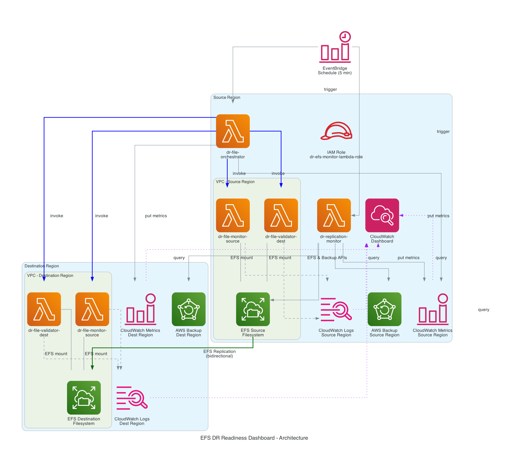

# Building custom CloudWatch monitoring for Amazon EFS replication
  
  > **Disclaimer:** This is sample code, for non-production usage. You should work with your security and legal teams to meet your organizational security, regulatory and compliance requirements before deployment.
  
  Build a custom Amazon CloudWatch dashboard that provides pre-failover DR readiness monitoring for Amazon EFS cross-region replication — replication health, file-level checksum validation, data-size/file-count
  comparison, and AWS Backup recovery-point visibility in a single view. The solution adapts automatically when replication direction reverses after a failover.
  
  This repository accompanies the AWS Storage Blog post "Building custom CloudWatch monitoring for Amazon EFS replication."
  
  ## Architecture
  
  
  Four Lambda functions, deployed as six deployments across two regions (the file monitor and file validator run in both regions; the orchestrator and replication monitor run in the source region only), triggered
  by an Amazon EventBridge schedule every 5 minutes, publishing to the `DR/EFSMonitor` CloudWatch namespace.
  
  ## Contents
  - `templates/template.yaml` — Lambda functions, IAM role, EventBridge schedule, log groups
  - `templates/dashboard-template.yaml` — the CloudWatch dashboard
  - `functions/*.py` — readable copies of the Lambda code (the templates embed this code inline via `ZipFile`; `template.yaml` is the source of truth)
  
  ## Prerequisites
  - An AWS account with permissions for Lambda, IAM, CloudWatch, and EFS
  - Two EFS filesystems in different AWS Regions with EFS replication enabled between them (same-region replication is not supported)
  - Mount targets in both regions with security groups allowing NFS (TCP 2049)
  - AWS CLI v2
  - (Optional) AWS Backup configured for both filesystems
  
  ## Deployment
  See the blog post for the full walkthrough. In brief: create EFS access points in each region, deploy `template.yaml` in the source region with `DeployOrchestrator=true`, deploy it in the destination region with
  `DeployOrchestrator=false`, then deploy `dashboard-template.yaml` in the source region.
  
  ## Cost
  Approximately $8.58/month at us-east-1 on-demand pricing on a small test filesystem (lower with CloudWatch/Lambda free-tier headroom). Filesystem-walk compute scales with file count.
  
  ## Security
  IAM follows least privilege: the Lambda execution role is granted `elasticfilesystem:ClientMount` and `ClientRootAccess`. `ClientWrite` is deliberately omitted, so the role cannot modify filesystem data. As
  shipped for simplicity, the sample creates an EFS access point with `PosixUser` Uid/Gid `0` and `RootDirectory` `/`, which gives the role **root-level read** access to the entire filesystem.
  
  For production, scope this down: create the access point with a non-root `PosixUser` and a dedicated `RootDirectory` subdirectory (this removes the need for `ClientRootAccess`), and optionally add an
  `elasticfilesystem:AccessPointArn` condition to the mount statement so the role can mount only through the intended access point. Traffic is TLS-encrypted in transit (NFS and HTTPS). See the blog's Security
  considerations section.

  ## Cleaning up
  Delete the CloudFormation stacks in reverse order (dashboard, destination monitor, source monitor), then remove the EFS access points.
  
  ## License
  This library is licensed under the MIT-0 License. See the LICENSE file.

